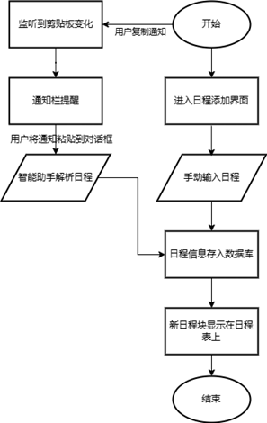
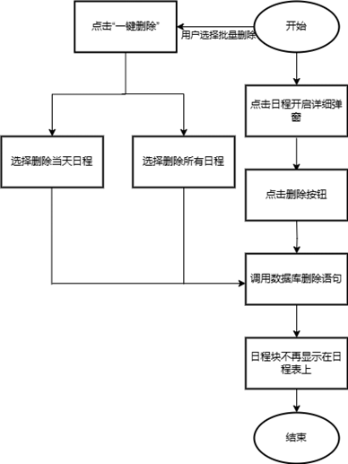

# AI-Calendar

## 简介
2024年OH竞赛训练营赛题开放AI应用赛道：基于OpenHarmony开发AI应用。
我们开发了一个智能日程表应用。通过集成AI智能解析功能，用户可以直接将复制的通知内容粘贴到日程表中，AI自动识别并提取有效信息，生成相应的日程块，大幅提升用户在日程安排上的效率。
-  应用具有以下基础功能：
1. 简化输入流程：快速、便捷地添加日程。
2. 提高信息准确性：减少手动输入错误。
3. 高效的信息提取：直接从社交平台或通知中提取关键信息。
4. 智能化管理：自动提供提醒和冲突检测。
- 进阶功能：
1. AI智能日程解析：显著减少手动输入，提升使用便利性。
2. 直观易用的用户界面：清晰的日历视图，快速浏览和管理日程。
3. 冲突检测功能：自动检查时间冲突，提升日程安排效率。
4. 智能提醒功能：事件开始前15分钟自动发送提醒。
5. 模糊日程处理功能：智能分配合理时间长度，确保时间管理连贯性。


具体项目文档见仓库内文件[智能日程表开发设计文档 .docx](https://gitee.com/QinyaoHe/ai-calendar/blob/master/README/%E6%99%BA%E8%83%BD%E6%97%A5%E7%A8%8B%E8%A1%A8%E5%BC%80%E5%8F%91%E8%AE%BE%E8%AE%A1%E6%96%87%E6%A1%A3%20.docx)，演示ppt[智能日程表应用介绍.pptx](https://gitee.com/QinyaoHe/ai-calendar/blob/master/README/智能日程表应用介绍.pptx)。

## 概要说明
 **背景** 
在数字化时代，随着智能设备的广泛普及和生活节奏的不断加快，人们对于时间管理和日程安排的需求变得前所未有的迫切。
在这样的背景下，我们设计了一款基于OpenHarmony的智能日程管理应用。该应用深度聚焦用户体验，不仅拥有直观、易用的UI界面，还集成了先进的智能日程解析、提醒和冲突检测等功能。它旨在帮助用户以更高的效率规划每一天，确保不错过任何重要的活动或任务。
通过这款应用，用户可以轻松管理自己的时间，享受更加有序和便捷的生活体验，无论是工作安排还是个人生活，都能够轻松掌握。
 **目的** 
该项目致力于解决现代生活中日益增长的时间管理挑战，为用户提供一种更加高效、直观的日程安排。在智能设备无处不在、生活节奏日益加快、工作压力不断增长的今天，人们迫切需要一种能够轻松应对复杂日程的工具，以确保时间得到最佳利用。
项目的核心目的在于通过开发一款基于OpenHarmony的智能日程管理应用，帮助用户优化日程管理。通过手动日程添加、智能日程解析等基本功能，用户能够轻松记录和组织生活中的每一个重要时刻。进阶功能的加入，如日程冲突检测、智能提醒，进一步提升了应用的实用性和智能化水平，使用户能够更加精准地掌握时间，避免日程冲突，提高生活和工作效率。


#### 开发环境及工具
- 系统环境：Windows 11
- 开发板环境：RK3568开发板并配置OpenHarmony v4.1系统
- 开发工具：devecostudio-windows-4.1.0.400
- SDK：API 11版本full SDK
## 设计思路
#### **基础功能设计**
- 手动添加日程功能：用户可以手动输入日程安排，系统提供简洁的UI界面以方便操作。
- 删除/编辑日程功能：用户通过点击日程块，可以便捷地在弹出的日程信息弹窗中选择删除或编辑操作，实现对该日程块的灵活管理。
- 直观易用的用户界面：用户可以通过清晰的日历视图快速浏览和管理自己的日程。
#### **用户需求**
 
- 简化输入流程：用户希望能够快速、便捷地添加日程，而不是进行繁琐的手动输入。
- 提高信息准确性：用户希望能够减少因手动输入而导致的错误，确保日程信息的准确性。
- 高效的信息提取：在信息来源多样化的今天，用户希望能够直接从社交平台或通知中提取关键信息，减少手动操作。
- 智能化管理：用户希望拥有智能化的管理工具，能够根据其日程自动提供提醒和冲突检测，以优化时间安排。
#### **创新与改进**
- 一键删除日程功能：用户可以选择一键删除当天日程或者日程表中所有日程，不必逐个对日程块进行删除操作。
- AI智能日程解析：首先，加入的AI智能日程解析功能显著减少了用户手动输入的需要，提升了使用便利性，用户只需简单粘贴通知消息，系统即可自动生成日程，避免了手动输入过程中可能出现的错误。
- 冲突检测功能：不仅如此，我们加入了冲突检测功能，当用户尝试添加新日程时，系统会自动检查是否与现有日程发生时间冲突，并及时通知用户，帮助用户有效避免日程冲突，提升日程安排的整体效率和合理性。
- 智能提醒功能：此外我们还引入了智能提醒功能，应用能够在事件开始前15分钟自动发送提醒通知，帮助用户合理安排时间，避免错过重要日程。
- 模糊日程处理功能：当在用户遇到时间信息不明确的任务时，AI智能助手会根据任务的性质智能地为任务分配合理的时间长度，并将其妥善安排进用户的日程表中，确保时间管理的连贯性和有效性。
- 便捷的下拉输入方式：应用支持通过下拉通知栏直接进入与AI对话页面。当应用监听到剪贴板内容发生变化时，会及时发送通知栏的通知，用户只需下拉通知栏，点击进入即可将复制的内容粘贴到日程表中。这种设计大大简化了日程输入流程，使得用户能够迅速添加新日程，提升了整体效率。
#### 最终实现思路
对于以上功能，我们结合OpenHarmony对应的模块一一实现：
1. 手动添加日程功能：使用了`@ohos.data.relationalStore`模块管理数据，使用了`@ohos.data.ValuesBucket`模块存储用户输入的日程，并将其存储到数据库中，使用`relationalStore.RdbStore` 提供的 API 进行插入操作，确保用户可以创建新日程。在成功插入日程信息后，使用`@ohos.events.emitter`模块发送事件，通知其他组件或页面更新数据。
2. 删除/编辑日程功能、一键删除日程功能：使用 `relationalStore.RdbStore` 提供的 API 进行删除和更新操作，确保用户可以删除或编辑已有日程。在成功删除或更改日程信息后，使用`@ohos.events.emitter`模块发送事件，通知其他组件或页面更新数据。
3. AI智能助手功能：使用了`@ohos.net.http`模块来实现与外部API的通信，主要用于发送用户的问题并接收助手的回答。
4. 智能日程解析功能、模糊日程处理功能：在处理时间信息不确切的情况时，智能助手将运用其内置算法对时间进行智能估算，以确定最佳的日程安排。对于用户提供的明确的日程信息，将直接使用正则表达式来提取智能助手返回的日程信息，包括事件标题、描述、地点、日期、开始时间和结束时间等信息，并结合`@ohos.data.relationalStore`模块实现日程信息的存储。在成功插入日程信息后，使用`@ohos.events.emitter`模块发送事件，通知其他组件或页面更新数据。
5. 日程冲突检测功能：通过构造SQL查询，利用三种条件检查新添加的日程与数据库中已有的日程是否存在时间重叠。在检测到冲突时，通过`@ohos.promptAction`模块向用户展示提示信息，确保用户能够及时了解问题，并做出相应的调整。
6. 通知栏快捷入口功能：使用了`@ohos.pasteboard`模块对用户的剪贴板进行监听，当监听到用户的剪贴板内容变化时进行发布通知。通过`@ohos.notificationManager`和`@ohos.app.ability.wantAgent`模块，实现了通过通知栏直接进入应用特定页面的功能。用户在复制通知内容到剪贴板后即可点击通知进入与AI智能助手对话的页面。
7. 智能日程提醒功能：结合了`@ohos.data.relationalStore`和`@ohos.notificationManager`模块，通过定时器`setInterval`定期检查即将到来的日程，确保在日程开始前15分钟发出提醒。

## 业务流程图  



> 添加日程



> 删除日程

## 模块与功能实现
#### 代码目录结构  

```
┣ main
┃ ┣ ets
┃ ┃ ┣ aiability
┃ ┃ ┃ ┗ AIAbility.ets //处理与智能助手相关的功能
┃ ┃ ┣ DateModule //日期相关的模块
┃ ┃ ┃ ┣ agendaStruct.ets //日程模型
┃ ┃ ┃ ┣ DatePicker.ets //日期选择器
┃ ┃ ┃ ┣ Reminder.ets //通知提醒
┃ ┃ ┃ ┣ ScheduleBlock.ets //日程块
┃ ┃ ┃ ┣ ScheduleColumn.ets //日程列
┃ ┃ ┃ ┣ theDate.ets //日期模型
┃ ┃ ┃ ┣ theTime.ets //时间模型
┃ ┃ ┃ ┣ TimePicker.ets //时间选择器
┃ ┃ ┃ ┗ TodoInfoDialog.ets //日程块信息弹窗
┃ ┃ ┣ entryability
┃ ┃ ┃ ┗ EntryAbility.ets
┃ ┃ ┣ GlobalContext //全局上下文管理模块
┃ ┃ ┃ ┗ GlobalContext.ts
┃ ┃ ┗ pages
┃ ┃ ┃ ┣ EditAgenda.ets //日程添加界面
┃ ┃ ┃ ┣ Index.ets //主界面（日程表界面）
┃ ┃ ┃ ┗ kimi.ets //智能助手界面
┃ ┣ resources
┃ ┃ ┣ base
┃ ┃ ┃ ┣ element
┃ ┃ ┃ ┣ media
┃ ┃ ┃ ┗ profile
┃ ┃ ┃ ┃ ┗ main_pages.json
┃ ┃ ┣ en_US
┃ ┃ ┣ rawfile
┃ ┃ ┗ zh_CN
┃ ┗ module.json5 //配置文件
```

## 模块说明
#### 页面显示模块
- 主界面 Index.ets：提供日程表的入口界面，用户可以在此界面查看和管理日程。
- 日程添加界面 EditAgenda.ets：用户可以在此手动输入日程的标题、日期、时间等信息。
- 智能助手界面 kimi.ets：集成AI助手功能，帮助用户智能解析日程信息并添加进日程表。
#### 控制器模块
- 日程管理控制器 ScheduleColumn.ets、 ScheduleBlock.ets：负责日程块的修改删除等操作，在数据库中更新数据。
- 日程显示控制器 TodoInfoDialog.ets：负责日程块具体信息的显示，从数据库中加载数据。
- 日期选择控制器 DatePicker.ets、时间选择控制器 TimePicker.ets：负责在用户手动添加日程时提供日期与时间选择的窗口。
- 通知管理控制器 Reminder.ets：处理与通知相关的逻辑，包括发布提醒和权限请求。
#### 模型模块
- 日期模型 theDate.ets：包含对日期的所有处理，例如获取今天的日期、返回指定日期所在周的七天等。
- 时间模型 theTime.ets：包含对时间的所有处理，例如获取当前的时间、计算两个时间之间的时间间隔等。
- 日程模型 agendaStruct.ets：定义日程的基本属性（如标题、时间、描述等）。
